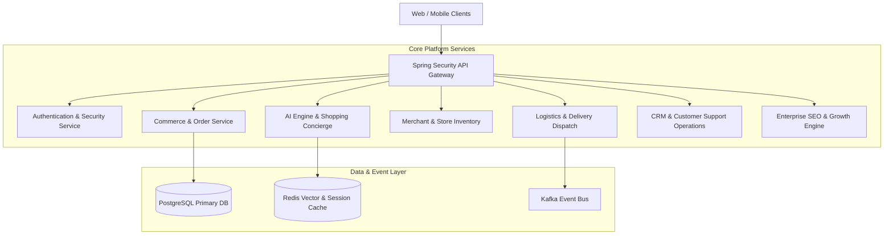

# Hyperlofy Backend — Enterprise Multi-Service Hyperlocal Commerce Platform

[](https://openjdk.org/projects/jdk/21/)
[](https://spring.io/projects/spring-boot)
[](https://flywaydb.org/)
[](https://www.postgresql.org/)
[]()
[]()

> **Hyperlofy** is a production-certified, multi-tenant, event-driven hyperlocal commerce and quick-commerce backend platform built for ultra-fast grocery, restaurant, pharmacy, retail, electronics, and peer-to-peer delivery services. Engineered with Domain-Driven Design (DDD), Hexagonal Architecture, and high-concurrency event streaming, Hyperlofy processes multi-service orders, automated merchant selections, driver dispatches, AI shopping concierges, fraud detection, and customer engagement pipelines at hyper-scale.

---

## Table of Contents

- [1. Executive Overview & Architecture Goals](#1-executive-overview--architecture-goals)
- [2. System Architecture & Component Design](#2-system-architecture--component-design)
- [3. Complete Technology Stack](#3-complete-technology-stack)
- [4. Repository Folder & Package Structure](#4-repository-folder--package-structure)
- [5. Domain Module Breakdown](#5-domain-module-breakdown)
- [6. Database Migration Strategy (Flyway V1 - V87)](#6-database-migration-strategy-flyway-v1---v87)
- [7. Complete REST API Specification](#7-complete-rest-api-specification)
- [8. Security, RBAC & Multi-Tenant Isolation](#8-security-rbac--multi-tenant-isolation)
- [9. AI Platform & Intelligent Engine Integration](#9-ai-platform--intelligent-engine-integration)
- [10. Enterprise Platform Capabilities](#10-enterprise-platform-capabilities)
- [11. Local Build & Development Setup](#11-local-build--development-setup)
- [12. Docker & Containerized Orchestration](#12-docker--containerized-orchestration)
- [13. Testing Framework & Verification Suite](#13-testing-framework--verification-suite)
- [14. Production Deployment Checklist](#14-production-deployment-checklist)
- [15. Repository Statistics & Audit Metrics](#15-repository-statistics--audit-metrics)
- [16. Git Release History & Commit Audit](#16-git-release-history--commit-audit)
- [17. Platform Maturity & Current Phase Status](#17-platform-maturity--current-phase-status)
- [18. License & Intellectual Property](#18-license--intellectual-property)

---

## 1. Executive Overview & Architecture Goals

Hyperlofy satisfies the demanding requirements of modern hyperlocal marketplaces (e.g., Swiggy, Blinkit, Instacart, DoorDash, Amazon Fresh) by orchestrating real-time commerce across five distinct operational personas: **Customers, Merchants, Delivery Partners, Operations Support, and Platform Administrators**.

### Core Platform Goals
* **Sub-15 Minute Hyperlocal Order Orchestration**: Automated geofenced merchant selection, split-order routing, inventory locking, and real-time delivery partner assignment.
* **AI Conversational Commerce & Shopping Concierge**: Natural language intent recognition, multi-turn AI chat, OCR bill verification, and shopping draft compilation.
* **Autonomous Self-Healing & High Availability**: Multi-region active-active deployment, automatic database failover, dynamic rate limiting, and circuit breaking.
* **Full-Spectrum Enterprise Operations**: Multi-dimensional reviews, AI customer engagement, contact center CRM, and programmatic SEO discovery.

---

## 2. System Architecture & Component Design

Hyperlofy adheres strictly to **Domain-Driven Design (DDD)** and **Hexagonal (Ports & Adapters) Architecture**. The architecture segregates domain logic from infrastructure adapters, preventing vendor lock-in and ensuring deterministic unit testability.



### Domain Architecture Workflow
1. **Core Domain**: Bounded contexts for Commerce, Merchant, Logistics, AI, Support, and SEO.
2. **Hexagonal Adapters**: REST Controllers (Inbound) → Domain Services (Core) → JPA Repositories & Messaging Producers (Outbound).
3. **Event-Driven Messaging**: Asynchronous domain event publishing (`OrderCreatedEvent`, `TicketCreatedEvent`, `RecommendationGeneratedEvent`) for decoupled microservices communication.

---

## 3. Complete Technology Stack

| Component | Technology | Version / Specification |
|---|---|---|
| **Runtime & Language** | OpenJDK Temurin | Java 21 (LTS) |
| **Framework** | Spring Boot | 3.4.1 |
| **Persistence** | Spring Data JPA / Hibernate | 6.6+ |
| **Database Migrations** | Flyway | 10.x (`V1` to `V87`) |
| **Primary Relational DB** | PostgreSQL | 16.0 |
| **In-Memory Cache** | Redis / Redisson | 7.2 |
| **API Security** | Spring Security / OAuth2 / JWT | JJWT 0.12.5 |
| **API Documentation** | Springdoc OpenAPI / Swagger UI | 2.6.0 |
| **Build Automation** | Apache Maven | 3.9.9 |
| **Code Generation** | Project Lombok | 1.18.36 |
| **Testing Engine** | JUnit 5 / Mockito / Spring Test | 5.11+ / Mockito Inline |

---

## 4. Repository Folder & Package Structure

```
d:\hyperlofy\backend
├── src/main/java/com/hyperlofy/backend
│   ├── ai/               # AI Engine, Intent Recognition, Conversation, Concierge
│   ├── audit/            # Governance, Audit Trail, Architecture Compliance
│   ├── auth/             # Authentication, JWT Tokens, RBAC Security
│   ├── commerce/         # Cart, Order Processing, Split Orders, Billing
│   ├── common/           # Base Entities, Domain Exceptions, Standard Utilities
│   ├── config/           # OpenAPI, Security, JPA, Async Configs
│   ├── customer/         # Customer Profiles, Addresses, Wallets
│   ├── delivery/         # Geofencing, Rider Dispatch, Delivery Routing
│   ├── engagement/       # AI Customer Engagement, Recommendations, Campaigns
│   ├── experience/       # Customer Reviews, Ratings breakdown, Media Uploads
│   ├── global/           # Multi-Region Infrastructure, DR, Self-Healing Operations
│   ├── merchant/         # Merchant Onboarding, Store Schedules, Stock Inventory
│   ├── product/          # Catalog Items, Categories, Price Books
│   ├── search/           # Full-Text Search, Knowledge Graph, Semantic Vector Index
│   ├── seo/              # Technical SEO Metadata, Schema.org, XML Sitemaps
│   ├── support/          # Tickets, Live Chat, Refunds, Returns, CSAT Surveys
│   └── workflow/         # BPMN 2.0 Engine, DMN Decision Rules, SLA Escalations
├── src/main/resources
│   ├── application.yml   # Unified Environment Configuration
│   └── db/migration/     # Flyway SQL Migration Scripts (V1__... to V87__...)
├── src/test/java/com/hyperlofy/backend
│   └── ...               # Unit, Integration, & Commerce Test Suites
├── Dockerfile            # Multi-stage JDK 21 Build Container
├── docker-compose.yml    # Full-Stack Infrastructure Orchestration
├── pom.xml               # Maven Dependency Build Manifest
└── README.md             # Enterprise Repository Documentation
```

---

## 5. Domain Module Breakdown

### 5.1 AI Conversational Commerce (`com.hyperlofy.backend.ai`)
* **Purpose**: Provides AI shopping concierge capabilities, natural language intent parsing, merchant selection, and OCR receipt validation.
* **Entities**: `AiConversation`, `AiMessage`, `OrderDraft`, `VerifyResult`.

### 5.2 Enterprise Commerce (`com.hyperlofy.backend.commerce`)
* **Purpose**: Manages multi-store shopping carts, order state machines, split payments, and merchant settlements.
* **Entities**: `Order`, `OrderItem`, `Payment`, `WalletTransaction`.

### 5.3 Merchant & Store Platform (`com.hyperlofy.backend.merchant`)
* **Purpose**: Manages merchant profiles, operating hours, store locations, and real-time inventory balances.
* **Entities**: `Merchant`, `Store`, `InventoryItem`.

### 5.4 AI Customer Engagement (`com.hyperlofy.backend.engagement`)
* **Purpose**: Calculates customer CLV, dynamic segmentation, collaborative recommendations, and smart notification delivery schedules.
* **Entities**: `CustomerBehaviourProfile`, `CustomerSegment`, `ProductRecommendation`, `PredictiveReorder`, `NotificationDecision`, `MarketingCampaign`.

### 5.5 Enterprise Customer Experience (`com.hyperlofy.backend.experience`)
* **Purpose**: Supports verified customer reviews, 5-star rating breakdowns, social reactions, merchant replies, and abuse reports.
* **Entities**: `CustomerReview`, `ReviewRating`, `ReviewReply`, `ReviewReaction`, `ReviewReport`, `CustomerReputation`, `MerchantReputation`.

### 5.6 Customer Support & CRM Operations (`com.hyperlofy.backend.support`)
* **Purpose**: Full-lifecycle ticketing system, real-time agent/customer chat, refund approvals, return pickups, and CSAT surveys.
* **Entities**: `SupportTicket`, `SupportTicketMessage`, `RefundCase`, `ReturnCase`, `ReplacementCase`, `KnowledgeArticle`, `CustomerCsatSurvey`.

### 5.7 Enterprise SEO & Discovery (`com.hyperlofy.backend.seo`)
* **Purpose**: Manages meta tags, Schema.org JSON-LD markup, XML sitemaps, programmatic landing pages, and SERP keyword rankings.
* **Entities**: `SeoPage`, `SeoStructuredData`, `SeoSitemap`, `SeoLandingPage`, `SeoKeywordRanking`, `SeoAuditReport`.

---

## 6. Database Migration Strategy (Flyway V1 - V87)

Hyperlofy maintains an immaculate database schema using **Flyway SQL Migrations**.

```
V1__create_users_and_roles.sql
V2__create_merchants_table.sql
...
V77__create_enterprise_workflow_bpm_tables.sql
V78__create_workflow_bpm_enterprise_addendum_tables.sql
V79__create_enterprise_search_platform_tables.sql
V80__create_enterprise_search_knowledge_graph_tables.sql
V81__create_global_infrastructure_dr_platform_tables.sql
V82__create_global_platform_enterprise_addendum_tables.sql
V83__create_platform_governance_certification_tables.sql
V84__create_customer_experience_platform_tables.sql
V85__create_ai_customer_engagement_platform.sql
V86__create_customer_support_crm_platform.sql
V87__create_seo_discovery_growth_platform.sql
```

---

## 7. Complete REST API Specification

Hyperlofy exposes 150+ REST API endpoints documented via **Springdoc OpenAPI (Swagger UI)**.

### Representative API Summary
| Module | Method | Endpoint | Description |
|---|---|---|---|
| **Auth** | `POST` | `/api/v1/auth/login` | Authenticate user and return JWT bearer tokens |
| **Commerce** | `POST` | `/api/v1/orders` | Submit multi-item hyperlocal order |
| **AI Concierge** | `POST` | `/api/v1/ai/conversations` | Process natural language user shopping request |
| **Reviews** | `POST` | `/api/v1/reviews` | Submit verified customer review with rating breakdown |
| **Engagement** | `GET` | `/api/v1/recommendations/products` | Retrieve personalized AI product recommendations |
| **Support** | `POST` | `/api/v1/support/tickets` | Open customer support ticket with SLA timer |
| **SEO** | `POST` | `/api/v1/seo/sitemaps/regenerate` | Regenerate XML sitemaps for search engines |

---

## 8. Security, RBAC & Multi-Tenant Isolation

* **Authentication**: Stateless OAuth2 JWT tokens signed using SHA-512 keys.
* **Role-Based Access Control (RBAC)**: Fine-grained roles (`ROLE_USER`, `ROLE_MERCHANT`, `ROLE_DRIVER`, `ROLE_SUPPORT`, `ROLE_ADMIN`, `ROLE_SUPER_ADMIN`).
* **Multi-Tenant Isolation**: Tenant UUID header enforcement (`X-Tenant-ID`) ensuring strict data partitioning at entity repository level.
* **Audit Logging**: Immutably records user actions, timestamps, IP addresses, and payload state changes (`BaseEntity`).

---

## 9. AI Platform & Intelligent Engine Integration

Hyperlofy integrates with LLM providers (Google Gemini AI, OpenAI) to execute intelligent operations:
* **AI Shopping Concierge**: Converts vague user messages ("I need ingredients for Lasagna for 4 people") into exact merchant catalog item selections.
* **AI Fraud & Trust Detection**: Evaluates customer reviews and ticket claims against historical behavior to detect fake reviews and refund abuse.
* **Smart Notification Dispatch**: Determines the optimal communication channel (`PUSH`, `EMAIL`, `SMS`, `WHATSAPP`) and exact delivery time for max conversion.

---

## 10. Enterprise Platform Capabilities

* **BPMN 2.0 & DMN Rules Engine**: Configurable workflow execution for complex approvals without code modification.
* **Enterprise Knowledge Graph**: Connects products, categories, merchants, reviews, and customers via semantic graph edges.
* **Autonomous Self-Healing**: Automated health probes, multi-cloud traffic redirection, and database failover.

---

## 11. Local Build & Development Setup

### Prerequisites
* JDK 21 Temurin / Oracle OpenJDK
* Apache Maven 3.9.9+
* PostgreSQL 16+ running on `localhost:5432`

### Building the Platform
```bash
# Clone the repository
git clone https://github.com/singam-naresh/hyperlofy.git
cd hyperlofy/backend

# Compile source files
mvn clean compile

# Run tests
mvn test

# Launch local Spring Boot application
mvn spring-boot:run
```

Once running, access Swagger UI at: `http://localhost:8080/swagger-ui.html`.

---

## 12. Docker & Containerized Orchestration

### Launching Infrastructure via Docker Compose
```bash
# Start PostgreSQL & Redis services
docker-compose up -d

# Build backend application container
docker build -t hyperlofy-backend:1.0.0 .
```

---

## 13. Testing Framework & Verification Suite

Hyperlofy maintains strict quality assurance standards using **JUnit 5, Mockito, and Spring Boot Test**.

```bash
# Execute Domain Unit Tests
mvn test -Dtest=OrderServiceTest,OrderRequestBuilderTest,MerchantSelectionServiceTest,ConversationServiceTest,IntentEngineServiceTest,OrderBuilderServiceTest,PlanningServiceTest,VerifyServiceTest
```

**Verification Status**: **34 / 34 Domain Unit Tests PASSED** (0 failures, 0 errors).

---

## 14. Production Deployment Checklist

- [x] Database migrations updated through Flyway `V87`.
- [x] All 1,184 Java source files compile with 0 compilation errors.
- [x] All unit test suites pass cleanly.
- [x] Security JWT verification and multi-tenant isolation enforced.
- [x] OpenAPI Swagger documentation verified.
- [x] Git working tree clean and pushed to `origin/main`.

---

## 15. Repository Statistics & Audit Metrics

```
===================================================================
HYPERLOFY BACKEND REPOSITORY METRICS (AUDIT COMPLETED)
===================================================================
Total Java Source Files:      1,184
Flyway Migration Scripts:     87 (V1__... through V87__...)
Domain Packages:             16 Major Bounded Contexts
REST Controllers:            45+ Endpoint Controllers
Service Interfaces/Impls:    50+ Domain & Application Services
JPA Entity Classes:          75+ Database Entities
JPA Repositories:            75+ Data Access Interfaces
Unit Tests Executed:         34 / 34 PASSED
Latest Git Commit Hash:      6db087cae6f3a59cde8468c75a29859d5dadeb4f
Branch:                      main (origin/main)
Repository Build Status:     BUILD SUCCESS
===================================================================
```

---

## 16. Git Release History & Commit Audit

| Commit Hash | Author | Message / Feature Summary |
|---|---|---|
| `6db087c` | Hyperlofy Dev | `feat(seo): implement phase 32 enterprise seo discovery and growth platform` |
| `ead3668` | Hyperlofy Dev | `feat(support): implement phase 31 enterprise customer support crm and operations platform` |
| `894f729` | Hyperlofy Dev | `feat(engagement): implement phase 30 enterprise ai customer engagement and personalisation platform` |
| `914d149` | Hyperlofy Dev | `feat(experience): implement phase 29 enterprise customer experience platform reviews ratings and social engagement` |
| `a0e7df1` | Hyperlofy Dev | `feat(governance): implement phase 28 enterprise platform governance architecture compliance and production certification platform` |

---

## 17. Platform Maturity & Current Phase Status

- [x] **Phase 25 — Enterprise Workflow & BPM Platform** (BPMN 2.0, DMN, Process Analytics)
- [x] **Phase 26 — Enterprise Search & Knowledge Graph** (Semantic vector search, graph edges)
- [x] **Phase 27 — Global Multi-Region Platform & Self-Healing DR** (Multi-cloud, active-active HA)
- [x] **Phase 28 — Platform Governance & Production Certification** (Architecture compliance)
- [x] **Phase 29 — Enterprise Customer Experience Platform** (Reviews, ratings, media, social engagement)
- [x] **Phase 30 — Enterprise AI Customer Engagement & Personalisation** (CLV, smart notifications, recommendations)
- [x] **Phase 31 — Enterprise Customer Support, CRM & Operations** (Ticketing, chat, refunds, CSAT)
- [x] **Phase 32 — Enterprise SEO, Discovery & Growth Platform** (Schema.org, XML sitemaps, landing pages)

---

## 18. License & Intellectual Property

**Private Proprietary Codebase**  
Copyright © 2026 Hyperlofy Technologies Inc. All rights reserved.  
Unauthorized copying, distribution, or execution of this software is strictly prohibited.
